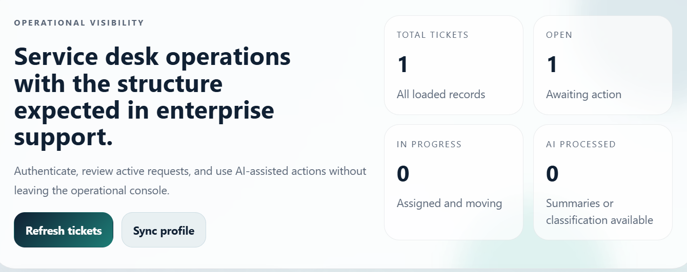
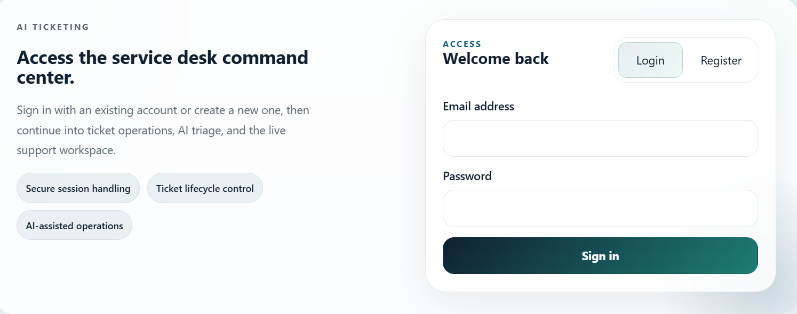
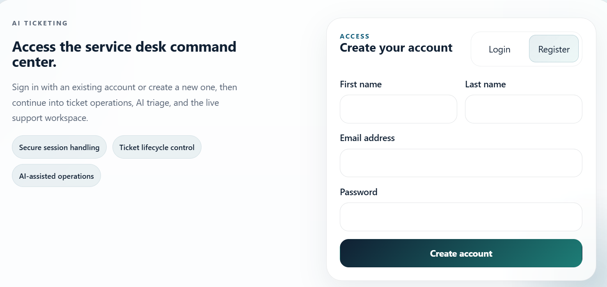
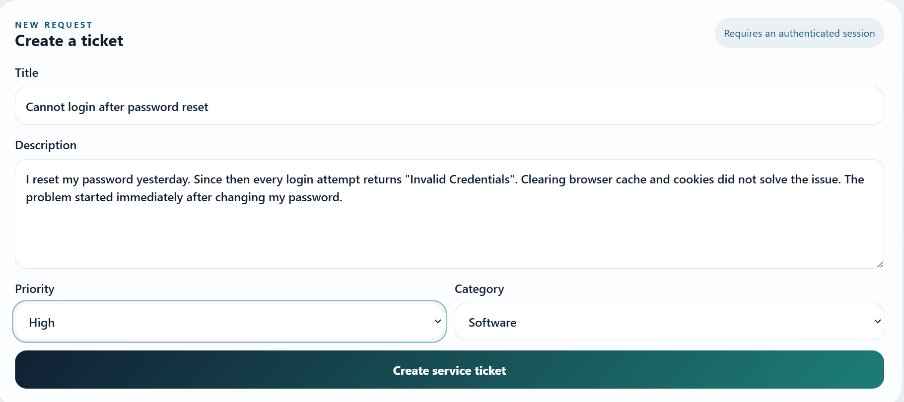
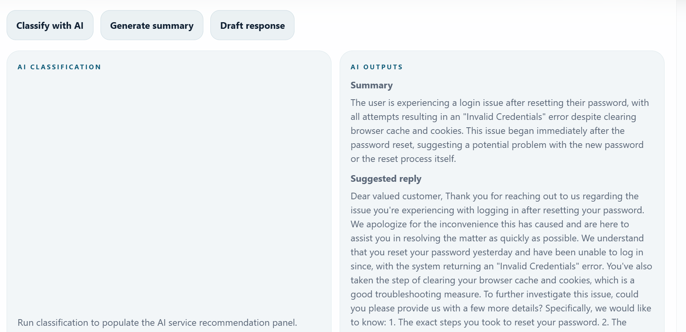
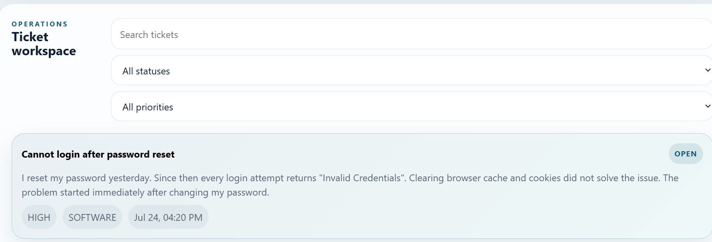
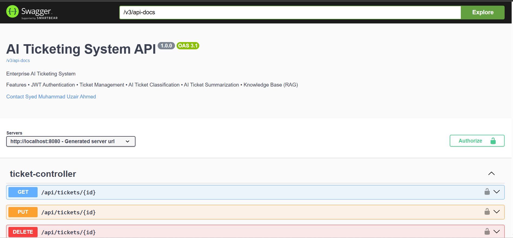

<div align="center">

# 🤖 AI Ticketing System

### Enterprise AI-Powered Ticket Management Platform

A full-stack AI-powered ticketing system built with **Spring Boot**, **React**, **Spring AI**, **Groq**, and **Qdrant** that automates ticket analysis using Retrieval-Augmented Generation (RAG).


---

### 🚀 Intelligent Ticket Analysis • Semantic Search • AI Assistance • Enterprise Security

</div>

---

# 📖 Overview

The **AI Ticketing System** is an enterprise-grade full-stack application that combines modern ticket management with Artificial Intelligence to streamline customer support workflows.

Instead of relying solely on a Large Language Model (LLM), the system implements **Retrieval-Augmented Generation (RAG)**. Historical support tickets are converted into embeddings and stored in **Qdrant Vector Database**. Whenever a new ticket is submitted, the application retrieves semantically similar historical tickets and provides them as contextual knowledge to the LLM before generating its response.

This approach enables the AI to understand how similar issues were previously resolved, producing significantly more relevant summaries, classifications, priority predictions, and suggested resolutions.

The project follows enterprise software engineering principles including layered architecture, DTO-based communication, secure JWT authentication, role-based authorization, RESTful APIs, global exception handling, pagination, filtering, validation, and OpenAPI documentation.

---

# ✨ Key Features

## 🔐 Authentication & Security

- JWT Authentication
- Secure Login & Registration
- Role-Based Authorization
- BCrypt Password Encryption
- Spring Security
- Stateless Authentication
- Protected REST APIs

---

## 🎫 Ticket Management

- Create Tickets
- Update Tickets
- Delete Tickets
- Assign Tickets
- Ticket Status Management
- Ticket Priority Management
- Dynamic Filtering
- Pagination
- Sorting
- Search by Title
- Global Exception Handling

---

## 🤖 AI Features

- AI Ticket Summarization
- AI Category Prediction
- AI Priority Prediction
- AI Suggested Resolution
- Similar Ticket Discovery
- Retrieval-Augmented Generation (RAG)
- Knowledge Base Search
- Semantic Similarity Search
- Context-Aware AI Responses
- Historical Ticket Understanding
- Spring AI Integration
- Groq Llama 3.3 70B Integration

---

# 🧠 Why RAG?

Traditional LLM-based ticketing systems answer questions using only the model's pretrained knowledge.

This project enhances AI responses using **Retrieval-Augmented Generation (RAG)**.

Instead of asking the model to generate answers blindly, the workflow is:

1. Generate an embedding for the incoming ticket.
2. Search **Qdrant Vector Database** for semantically similar historical tickets.
3. Retrieve the most relevant previous support cases.
4. Inject retrieved context into the AI prompt.
5. Generate a response grounded in real organizational knowledge.

This makes AI responses significantly more accurate, consistent, and explainable.

---

# 🎥 Demo

> Replace this with your Loom or YouTube demo.

```
https://your-demo-link
```

---

# 📸 Application Showcase

## 🏠 Dashboard



---

## 🔐 Login



---

## 📝 User Registration



---

## 🎫 Create Ticket



---

## 🤖 AI Ticket Analysis



---

## 🔍 Similar Historical Tickets (Qdrant)


---

## 📄 Ticket Details



---

## 📚 Swagger Documentation



---

# 🧠 AI Workflow

```text
                   User Creates Ticket
                           │
                           ▼
               Generate Ticket Embedding
                           │
                           ▼
               Search Qdrant Vector Database
                           │
                           ▼
           Retrieve Similar Historical Tickets
                           │
                           ▼
               Build Context-Aware Prompt
                           │
                           ▼
               Spring AI + Groq Llama 3.3 70B
                           │
          ┌────────────────┼────────────────┐
          ▼                ▼                ▼
     AI Summary      AI Category      AI Priority
                           │
                           ▼
              Suggested Resolution Generation
                           │
                           ▼
                  Save AI Analysis to Database
```

---

# 🏗️ System Architecture

```text
                         React + TypeScript + Vite
                                      │
                                      ▼
                             Spring Boot REST API
                                      │
               ┌──────────────────────┼──────────────────────┐
               ▼                      ▼                      ▼
        Spring Security         Ticket Service         Spring AI
               │                      │                      │
               ▼                      ▼                      ▼
            JWT Auth               MySQL               Prompt Builder
                                                             │
                                                             ▼
                                                 Qdrant Vector Database
                                                             │
                                                             ▼
                                             Similar Historical Tickets
                                                             │
                                                             ▼
                                                   Groq Llama 3.3 70B
                                                             │
                                                             ▼
                                                   AI Generated Response
```

---

# 📂 Repository Structure

```text
root/
│
├── README.md
│
├── AI-Ticketing-System/                # Spring Boot Backend
│   ├── src/
│   │   ├── main/
│   │   │   ├── java/
│   │   │   │   └── com/uzair/aiticketing/
│   │   │   │       ├── ai/
│   │   │   │       ├── auth/
│   │   │   │       ├── attachment/
│   │   │   │       ├── common/
│   │   │   │       ├── knowledgebase/
│   │   │   │       ├── security/
│   │   │   │       ├── ticket/
│   │   │   │       └── user/
│   │   │   │
│   │   │   └── resources/
│   │   │       ├── application.properties
│   │   │       └── application.yml
│   │   │
│   │   └── test/
│   │
│   ├── pom.xml
│   ├── mvnw
│   └── mvnw.cmd
│
├── frontend/                           # React + TypeScript + Vite
│   ├── src/
│   ├── public/
│   ├── package.json
│   ├── vite.config.ts
│   ├── tsconfig.json
│   └── ...
│
├── screenshots/
│   ├── dashboard.png
│   ├── login.png
│   ├── register.png
│   ├── create-ticket.png
│   ├── ai-analysis.png
│   ├── qdrant-search.png
│   ├── ticket-details.png
│   ├── swagger-ui.png
│   └── architecture.png
│
└── .gitignore
```

---

# 🛠 Technology Stack

| Category | Technology |
|------------|------------|
| Language | Java 21 |
| Backend | Spring Boot 3.5 |
| Frontend | React 19 |
| Language | TypeScript |
| Build Tool | Maven |
| Frontend Build | Vite |
| Security | Spring Security |
| Authentication | JWT |
| ORM | Spring Data JPA |
| Database | MySQL |
| AI Framework | Spring AI |
| LLM | Groq Llama 3.3 70B |
| Vector Database | Qdrant |
| AI Technique | Retrieval-Augmented Generation (RAG) |
| API Documentation | Swagger / OpenAPI |

---

# 🚀 Getting Started

## Prerequisites

Before running the project ensure you have installed:

- Java 21+
- Maven 3.9+
- Node.js 20+
- npm
- MySQL 8+
- Qdrant
- Groq API Key

---

# 📥 Clone Repository

```bash
git clone https://github.com/uzair958/AI-Ticketing-System.git
```

```bash
cd AI-Ticketing-System
```

---

# ⚙ Backend Setup

Navigate to the backend project.

```bash
cd AI-Ticketing-System
```

Install dependencies

```bash
mvn clean install
```

Run the application

```bash
mvn spring-boot:run
```

Backend will start at

```
http://localhost:8080
```

---

# 🌐 Frontend Setup

Open another terminal.

Navigate to the frontend.

```bash
cd frontend
```

Install packages

```bash
npm install
```

Run Vite

```bash
npm run dev
```

Frontend

```
http://localhost:5173
```

---

# 🗄 MySQL Configuration

Create a database.

```sql
CREATE DATABASE ai_ticketing;
```

Update

```
AI-Ticketing-System/src/main/resources/application.properties
```

```properties
spring.datasource.url=jdbc:mysql://localhost:3306/ai_ticketing

spring.datasource.username=YOUR_USERNAME

spring.datasource.password=YOUR_PASSWORD

spring.jpa.hibernate.ddl-auto=update

spring.jpa.show-sql=true
```

---

# 🤖 Spring AI Configuration

Configure your Groq API.

```properties
spring.ai.openai.api-key=YOUR_GROQ_API_KEY

spring.ai.openai.base-url=https://api.groq.com/openai

spring.ai.openai.chat.options.model=llama-3.3-70b-versatile
```

Since Groq provides an OpenAI-compatible API, Spring AI integrates seamlessly without requiring any additional provider-specific implementation.

---

# 🔍 Qdrant Configuration

Configure your vector database.

```properties
qdrant.host=localhost

qdrant.port=6334

qdrant.collection=ticket-knowledge-base
```

The application uses Qdrant to store vector embeddings generated from historical support tickets.

When a new ticket is created, the system retrieves semantically similar tickets from Qdrant before invoking the LLM.

---

# 🔑 Environment Variables

Create an `.env` file (or configure environment variables depending on your deployment).

```env
MYSQL_USERNAME=YOUR_USERNAME

MYSQL_PASSWORD=YOUR_PASSWORD

JWT_SECRET=YOUR_SECRET_KEY

GROQ_API_KEY=YOUR_GROQ_API_KEY

QDRANT_HOST=localhost

QDRANT_PORT=6334
```

---

# 📚 API Documentation

Once the backend is running, Swagger UI is available at

```
http://localhost:8080/swagger-ui/index.html
```

Interactive documentation includes all available REST endpoints, request models, response schemas, and authentication support.

---

# 🔐 Authentication

Authenticate using the Login endpoint.

Include the returned JWT token in every protected request.

```
Authorization: Bearer YOUR_JWT_TOKEN
```

---

# 💡 Core AI Pipeline

The AI pipeline follows these steps:

1. User creates a support ticket.
2. Ticket text is converted into embeddings.
3. Embeddings are searched against Qdrant.
4. Similar historical tickets are retrieved.
5. Retrieved context is injected into the prompt.
6. Spring AI communicates with Groq Llama 3.3 70B.
7. AI generates:
    - Summary
    - Category
    - Priority
    - Suggested Resolution
8. AI output is stored alongside the ticket.


# 🎯 Example Workflow

The following diagram illustrates a typical end-to-end workflow of the application.

```text
                  User Registration
                          │
                          ▼
                     User Login
                          │
                          ▼
                    Receive JWT Token
                          │
                          ▼
                 Create Support Ticket
                          │
                          ▼
               Generate Ticket Embedding
                          │
                          ▼
           Search Qdrant Vector Database
                          │
                          ▼
         Retrieve Similar Historical Tickets
                          │
                          ▼
      Build Context-Aware Prompt using Spring AI
                          │
                          ▼
              Groq Llama 3.3 70B Processes Prompt
                          │
        ┌─────────────────┼──────────────────┐
        ▼                 ▼                  ▼
  Ticket Summary     Category Prediction   Priority Prediction
                          │
                          ▼
             Suggested Resolution Generated
                          │
                          ▼
               Store Ticket + AI Analysis
                          │
                          ▼
           Manage Ticket through REST APIs
```

---

# 🔌 REST API Modules

| Module | Description |
|---------|-------------|
| Authentication | User Registration & Login |
| Users | User Management |
| Tickets | Ticket CRUD Operations |
| AI | AI Analysis & Suggestions |
| Knowledge Base | Historical Ticket Retrieval |
| Attachments | File Upload & Management |

---

# 📋 Core Backend Features

- Layered Architecture
- DTO Pattern
- Repository Pattern
- Service Layer Abstraction
- Global Exception Handling
- Custom Response Wrapper
- Request Validation
- Specification-based Dynamic Filtering
- Pagination
- Sorting
- Mapper Layer
- Role-Based Security
- JWT Authentication
- OpenAPI Documentation

---

# 🤖 AI Components

The AI module is designed around Retrieval-Augmented Generation (RAG) to ensure responses are grounded in historical support data.

### Components

- Spring AI
- Groq API
- Llama 3.3 70B
- Qdrant Vector Database
- Embedding Generation
- Prompt Construction
- Semantic Similarity Search
- Knowledge Base Retrieval

---

# 📚 Knowledge Base Workflow

Historical tickets are transformed into semantic embeddings and stored in **Qdrant**.

When a new ticket arrives:

1. Generate an embedding for the incoming ticket.
2. Perform semantic similarity search in Qdrant.
3. Retrieve the most relevant historical tickets.
4. Build a context-rich prompt using Spring AI.
5. Send the prompt to Groq Llama 3.3 70B.
6. Return AI-generated insights grounded in previous resolutions.

This approach enables more accurate and consistent responses than prompting an LLM without organizational context.

---

# 🚀 Future Enhancements

The project is designed with extensibility in mind.

Potential future improvements include:

- Hybrid Search (Semantic + Keyword)
- AI Confidence Scores
- Automatic Ticket Routing
- Multi-Agent AI Workflow
- OCR for Attachments
- Email Notifications
- Slack Integration
- Microsoft Teams Integration
- WebSocket Real-Time Updates
- Analytics Dashboard
- Docker Support
- Docker Compose
- Kubernetes Deployment
- GitHub Actions CI/CD
- Redis Caching
- Prometheus Monitoring
- Grafana Dashboards
- Elasticsearch Integration

---

# 🧪 Testing

Future testing plans include:

- Unit Testing
- Integration Testing
- Repository Testing
- Service Layer Testing
- Security Testing
- API Testing
- AI Pipeline Testing

---

# 📈 Performance Goals

- Fast semantic retrieval using Qdrant
- Stateless JWT authentication
- Optimized REST APIs
- Scalable layered architecture
- Efficient database access with Spring Data JPA

---

# 🤝 Contributing

Contributions are welcome!

If you'd like to improve the project:

1. Fork the repository.
2. Create a feature branch.

```bash
git checkout -b feature/new-feature
```

3. Commit your changes.

```bash
git commit -m "Add new feature"
```

4. Push your branch.

```bash
git push origin feature/new-feature
```

5. Open a Pull Request.

---

# 📄 License

This project is licensed under the MIT License.

Feel free to use, modify, and distribute it for educational and personal projects.

---

# 👨‍💻 Author

## Syed Muhammad Uzair Ahmed

AI Engineer passionate about building intelligent software systems using modern backend technologies, Large Language Models, Retrieval-Augmented Generation, and scalable cloud-native architectures.

### Connect with me

**GitHub**

https://github.com/uzair958

**LinkedIn**

https://www.linkedin.com/in/syed-muhammad-uzair-ahmed

**Portfolio**

https://useresearchbot.me

**Email**

muhammad.syed.uzair@gmail.com

---

<div align="center">

## ⭐ If you found this project useful, consider giving it a Star!

It helps others discover the project and motivates future improvements.

Thank you for visiting!

</div>